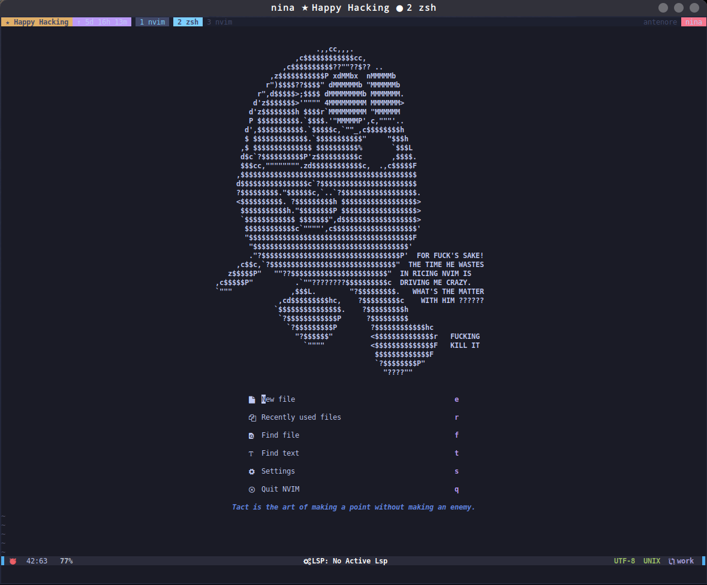

# Neovim config

* 99.99% Lua
* Neovim HEAD
* [mcchrish/zenbones.nvim:](https://github.com/mcchrish/zenbones.nvim) (tokyobones, see data/Xcolors for a matching terminal theme)
* [williamboman/mason.nvim: Portable package manager for Neovim](https://github.com/williamboman/mason.nvim)
* LSP, Treesitter, CMP, Neogit, lualine, nvim-tree, nvim-surround
* Mainly configured for C, Lua, Markdown and LaTeX editing
* See the plugin list at the end
* mdview is a terminal-only Markdown preview plugin I wrote myself.




## Dependencies

### neovim >= 0.7

* [Neovim Git repository](https://github.com/neovim/neovim.git)

```
cmake -DCMAKE_INSTALL_PREFIX=$HOME/neovim -DCMAKE_BUILD_TYPE=RelWithDebInfo -G 'Ninja' -B build/
ninja -C build -v
ninja -C build -v install
# Add
# alias vi=/home/antenore/neovim/bin/nvim
```

### marksman (Markdown)

* https://github.com/artempyanykh/marksman/releases

Download and link in the PATH

### prosemd_lsp (Markdown)

Proofreading for Markdown

```
cargo install prosemd-lsp
```

### Puppet LS

* https://github.com/puppetlabs/puppet-editor-services

```
bundle install
bundle exec rake gem_revendor
# cmd = { '/home/antenore/software/puppet-editor-services/puppet-languageserver', '--stdio' },
```
### jsonls

```
sudo npm i -g vscode-langservers-extracted
```

### Solargraph (ruby)

```
gem install solargraph
```

### eslint

```
sudo npm -g install eslint
```

### tsserver

```
sudo npm install -g typescript typescript-language-server
```

### Vim LS

```
sudo npm install -g vim-language-server
```
### Bash LS

```
sudo npm i -g bash-language-server
```
## Installed plugins

* alpha-nvim
* clangd_extensions.nvim
* cmp-buffer
* cmp-calc
* cmp-cmdline
* cmp-emoji
* cmp-look
* cmp_luasnip
* cmp-nvim-lsp
* cmp-nvim-lsp-signature-help
* cmp-nvim-lua
* cmp-nvim-tags
* cmp-path
* cmp-spell
* cmp-treesitter
* csv.vim
* diffview.nvim
* filetype.nvim
* friendly-snippets
* fzf
* fzf.vim
* gitsigns.nvim
* impatient.nvim
* indent-blankline.nvim
* lsp-colors.nvim
* lsp_extensions.nvim
* lsp_signature.nvim
* lualine.nvim
* LuaSnip
* lush.nvim
* mason-lspconfig.nvim
* mason.nvim
* mdview.nvim
* neogit
* nlsp-settings.nvim
* null-ls.nvim
* nvim-autopairs
* nvim-cmp
* nvim-colorizer.lua
* nvim-lspconfig
* nvim-markdown
* nvim-tree.lua
* nvim-treesitter
* nvim-ts-rainbow
* nvim-web-devicons
* packer.nvim
* plenary.nvim
* popup.nvim
* puppet-syntax-vim
* telescope-fzf-native.nvim
* telescope.nvim
* telescope-symbols.nvim
* telescope-ui-select.nvim
* venn.nvim
* vim-devicons
* vim-easy-align
* vim-gutentags
* vim-ps1
* vim-puppet
* vimtex
* vim-tmux
* vista.vim
* yaml.nvim
* zenbones.nvim
